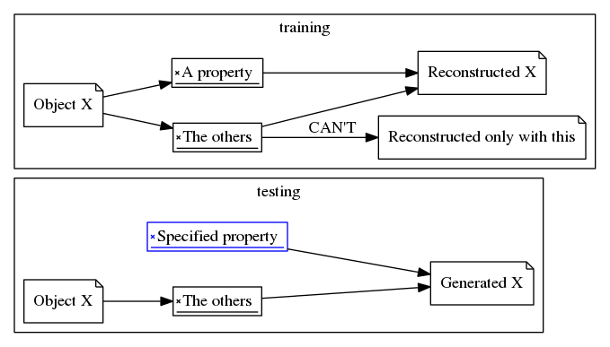
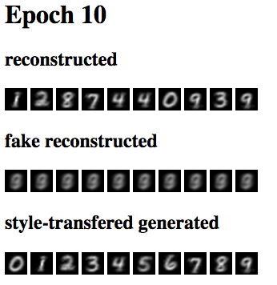

# HAE

## Requirements

- Python 3.x
- [Hylang](https://github.com/hylang/hy)
- [Keras 2.x](https://keras.io/)

## Results (screenshot)

For n-th item, the item on the 1st row, n-th column is the reconstructed item with a normal autoencoder.
And the 2nd is reconstructed with a fake autoencoder, which uses the information without the label (digit).
And the 3rd is reconstructed with the normal autoencoder, with another label (given 'm' for m-th column).
